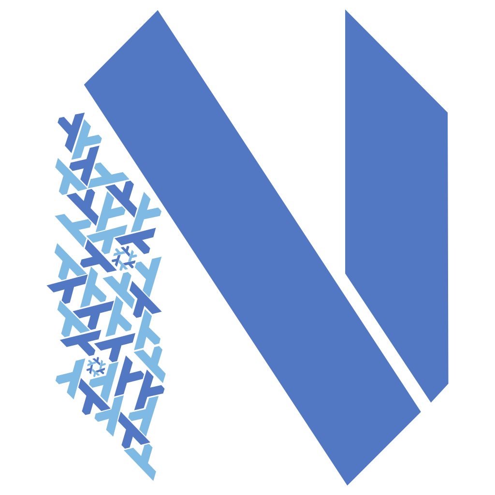

<div align="center">
    
</div>
<h1 align="center">❄️  neovim-flake</h1>
<div align="center">
<p>
    <a href="https://github.com/NotAShelf/neovim-flake/releases/latest">
      
    </a>
    <a href="https://github.com/NotAShelf/neovim-flake/pulse">
      
    </a>
    <a href="https://github.com/NotAShelf/neovim-flake/blob/main/LICENSE">
      
    </a>
    <a href="https://github.com/NotAShelf/neovim-flake/stargazers">
      
    </a>
    <a href="https://github.com/NotAShelf/neovim-flake/issues">
      
    </a>
    <a href="https://github.com/NotAShelf/neovim-flake">
      
    </a>
</p>

<p align="center">
    
</p>

<div align="center">
  <a>
    A highly modular, configurable, extensible and easy to use Neovim configuration wrapper written in Nix. Designed for flexibility and ease of use, this flake allows you to easily configure your Neovim instance with a few lines of Nix code.
  </a>
</div>

</div>

---

<div align="center"><p>

**[<kbd> <br> Get Started <br> </kbd>][Get Started]**
**[<kbd> <br> Documentation <br> </kbd>][Documentation]**
**[<kbd> <br> Help <br> </kbd>][Help]**
**[<kbd> <br> Contribute <br> </kbd>][Contribute]**
**[<kbd> <br> FAQ <br> </kbd>][Faq]**
**[<kbd> <br> Credits <br> </kbd>][Credits]**

</p></div>

[Get Started]: #get-started
[Documentation]: #documentation
[Help]: #help
[Contribute]: #contributing
[FAQ]: #faq
[Credits]: #credits

---

## Get Started

### Using `nix` CLI

If you would like to try out the configuration before even thinking about installing it, you can run the following command

```console
nix run github:notashelf/neovim-flake
```

This will get you a feel for the base configuration and UI design. The flake exposes `#nix` as the default package, providing minimal language support and various
utilities.You may also use `#nix`, `#tidal` or `#maximal` to get try out different configurations.

It is as simple as changing the target output to get a different configuration. For example, to get a configuration with `tidal` support, run:

```console
nix run github:notashelf/neovim-flake#tidal
```

Similar instructions will apply for `nix profile install`. However, you are recommended to instead use the module system as described in the manual.

> [!NOTE]  
> The `maximal` configuration is _massive_ and will take a while to build. To get a feel for the configuration, use the default `nix` or `tidal` configurations.
> Should you choose to try out the `maximal` configuration, using the binary cache as described in the manual is _strongly_ recommended.

### Docker

As of version 0.5, an image for the `nix` output is published to Dockerhub and GitHub packages with each tagged release. If you do not have Nix installed
on your system, you may run neovim within a container using your favorite tool.
The following command will open the current directory in neovim with necessary tools bootstrapped.

```console
docker run -v `pwd`:/home/neovim/demo --rm -it notashelf/neovim-flake:latest
```

The available registeres are `ghcr.io` and `dockerhub` for the time being. Adjust to your liking.

## Documentation

See the [neovim-flake Manual](https://notashelf.github.io/neovim-flake/) for detailed installation guides, configurations, available options, release notes
and more.

If you want to dive right into trying **neovim-flake** you can get a fully featured configuration with `nix`
language support by running:

```console
nix run github:notashelf/neovim-flake
```

Please create an issue on the [issue tracker](../../../issues) if you find the documentation lacking or confusing.
I also appreciate any contributions to the documentation.

## Help

You can create an issue on the [issue tracker](../../../issues) to ask questions or report bugs.
I am not yet on spaces like matrix or IRC, so please use the issue tracker for now.

## Contributing

I am always looking for new ways to help improve this flake. If you would like to contribute, please read
the [contributing guide](CONTRIBUTING.md) before submitting a pull request. You can also create an
issue on the [issue tracker](../../../issues) before submitting a pull request if you would like to discuss
a feature or bug fix.

## Philosophy

The philosophy behind this flake configuration is to create an easily configurable and reproducible Neovim environment.
While it does sacrifice in size (which I know some users will find _disagreeable_), it offers a lot of flexibility and customizability in
exchange for the large size of the flake inputs. The "KISS" (Keep it simple, stupid) principle has mostly been abandoned here, however, you _can_
ultimately leverage the flexibility of this flake to declare a configuration that follows KISS principles, as it is very easy to bring your
own plugins and configurations from non-nix. What this flake is meant to be does eventually fall into your hands. Whether you are a
developer, writer, or live coder, you can quickly craft a config that suits every project's need. Think of it like a distribution of Neovim that you have
full control over. A distribution that takes advantage of pinning vim plugins and third party dependencies (such as tree-sitter grammars, language servers, and more).

One should never get a broken config when setting options. If setting multiple options results in a broken Neovim, file an issue!
Each plugin knows when another plugin which allows for smart configuration of keybindings and automatic setup of things
like completion sources and languages.

## FAQ

**Q**: Why is this flake so big?
<br/>
**A**: I have sacrificed in size in order to provide a highly configurable and reproducible Neovim environment. A binary cache is provided to
eleminate the need to build the flake from source, but it is still a large flake. If you do not need all the features, you can use the default `nix` output
instead of the `maximal` output. This will reduce size by a lot, but you will lose some language specific features.
<br/><br/>

**Q**: Will you try to make this flake smaller?
<br/>
**A**: Yes. As a matter of fact, I am actively working on making this flake smaller. Unfortunately the process of providing everything
possible by itself makes the flake large. Best I can do is to optimize the flake as much as possible by selecting plugins that
are small and fast. And the binary cache, so at least you don't have to build it from source.
<br/><br/>

**Q**: Will you use a plugin manager/language server installer?
<br/>
**A**: No. If you feel the need to ask that question, then you have missed the whole point of using nix and ultimately this flake.
The whole reason we use nix is to be able to handle EVERYTHING declaratively, well including the LSP and plugin installations.
<br/><br/>

**Q**: Can you add _X_?
<br/>
**A**: Maybe. Open an issue using the appropriate template and I will consider it. I do not intend to
add _every plugin that is in existence_, but I will consider it, should it offer something useful to the flake.

## Credits

### Contributors

Special thanks to

- [@fufexan](https://github.com/fufexan) - For the transition to flake-parts
- [@FlafyDev](https://github.com/FlafyDev) - For getting the home-manager to work
- [@n3oney](https://github.com/n3oney) - For making custom keybinds finally possible
- [@horriblename](https://github.com/horriblename) - For actively implementing planned features and quality of life updates
- [@Yavko](https://github.com/Yavko) - For the amazing neovim-flake logo
- [@FrothyMarrow](https://github.com/FrothyMarrow) - For seeing mistakes that I could not

and everyone who has submitted issues or pull requests!

### Inspiration

This configuration borrows from and is based on a few other configurations, including:

- [@jordanisaacs's](https://github.com/jordanisaacs) [neovim-flake](https://github.com/jordanisaacs/neovim-flake) that this flake is originally based on.
- [@sioodmy's](https://github.com/sioodmy) [dotfiles](https://github.com/sioodmy/dotfiles) that inspired the design choices.
- [@wiltaylor's](https://github.com/wiltaylor) [neovim-flake](https://github.com/wiltaylor/neovim-flake) for plugin and design ideas.
- [@gvolpe's](https://github.com/gvolpe) [neovim-flake](https://github.com/gvolpe/neovim-flake) for plugin, design and nix concepts.

I am grateful for their previous work and inspiration, and I wholeheartedly recommend checking their work out.
<br/>

---
